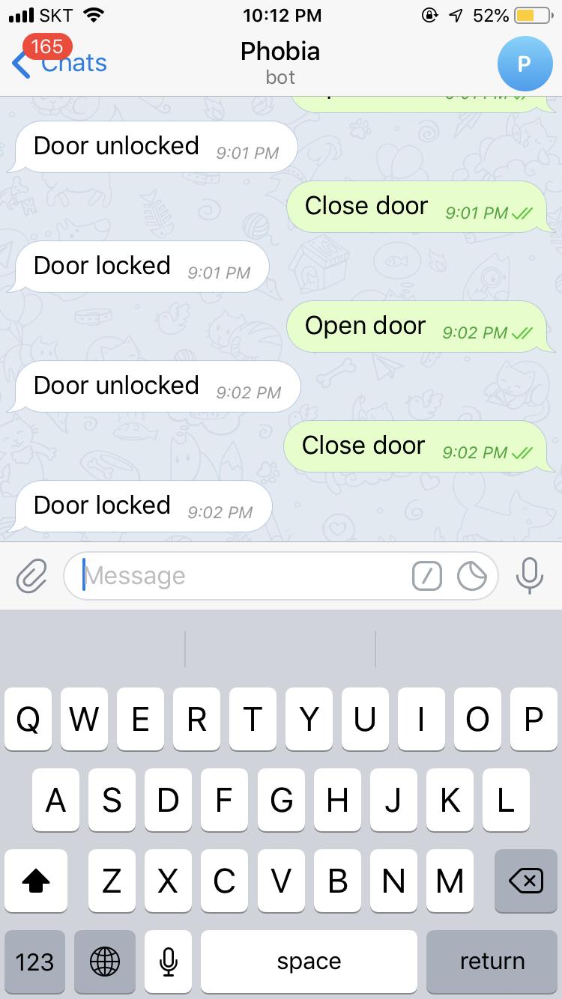

# Telegram home

## materials 
<ul>
  
<li>Raspberry pi – mini computer</li>
<li>Streaming camera or Raspberry pi camera</li>
<li>Servo motor – to control the lock</li>
<li>LED Lights – to show the lock condition (open/close)</li>
<li>Software(Language):</li>
<li>Python</li> 
<li>Telepot, Motion</li> 
</ul>

## Setting up Pi

### install Raspebbry pi 

## Steps 

1. Step

    Get your Raspberry Pi from Here.
    - sudo apt update

2. Step 

    Run raspi config and enable camera module

    - sudo raspi-config

 3. Step 
    
    Now you can install motion by running the command

    -sudo apt install motion

    its time to edit configuration file

    -sudo nano /etc/motion/motion.conf

### install telepot
pip install telepot

#### after installing telepot . Now if the both listen_bot.py and motion -c ~/motion/motion.conf are running, the system should work.

#####run the service
##### pi@raspberrypi:/etc/systemd/system $ service listen status

## Setting up Servo and LED
### set up servo and LED to GPIO by following this picture

 
### Test your code 

## Finally build model of the door

